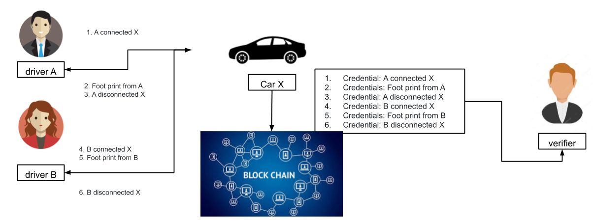
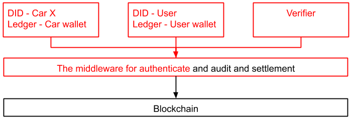

# Device wallet
This is a simple demo for a device wallet used by DID and IOTA Tangle.
We construct a open and public backbone to authenticate and audit the credentials that issue from 4 actors:
- User-A
- User-B
- Car-X
- Verifier

## Scenario

According the scenario picture as above, we assume:
1. A DID (driver A) connect (authenticate) to a DID (car X)
2. The DID (driver A) issue events by DID (car X)
3. A DID (driver A) disconnect to a DID (car X)

4. B DID (driver B) connect (authenticate) to a DID (car X)
5. The DID (driver B) issue events by DID (car X)
6. B DID (driver B) disconnect to a DID (car X)

7. A verifier audit the footprint from the DID (car X) of blockchain.

## Features
1. Self-sovereign identity.
2. Settlement at any time.
3. A public blockchain backbone to access data easily.
4. Conform to the DID verifiable claims specifications to keep the 3rd party service to bridge.

## Architecture

## Credentials
1. Credential: A connected X
2. Credentials: Foot print from A
3. Credential: A disconnected X
4. Credential: B connected X
5. Credentials: Foot print from B
6. Credential: B disconnected X

## Online review tools
- [RSA Signature/Generation & Validation](https://8gwifi.org/rsasignverifyfunctions.jsp)

## TODO
- Deposit and withdraw
- DID VC well-form
